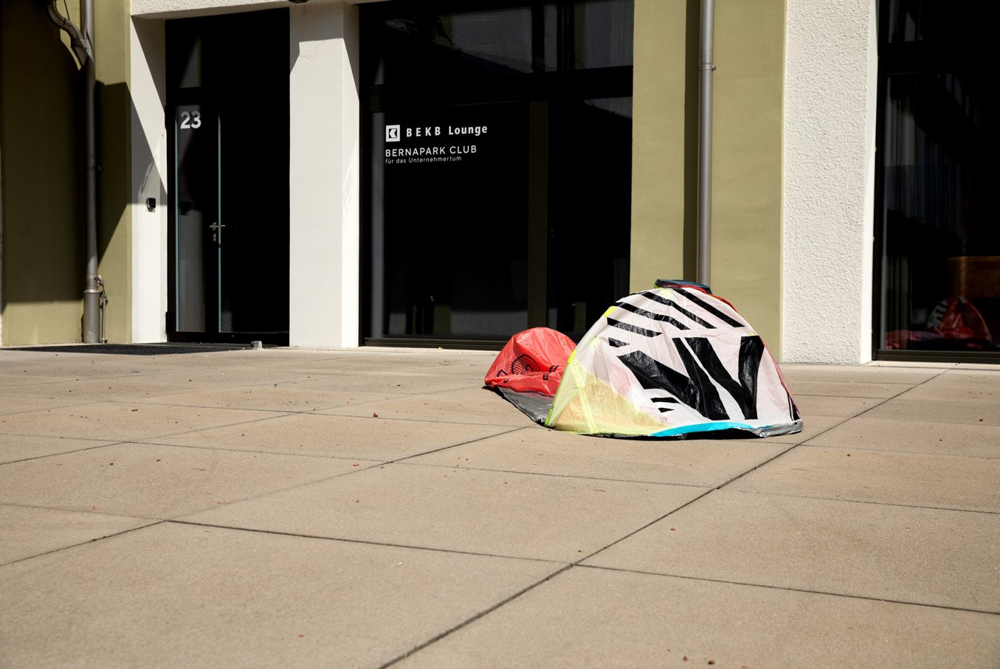
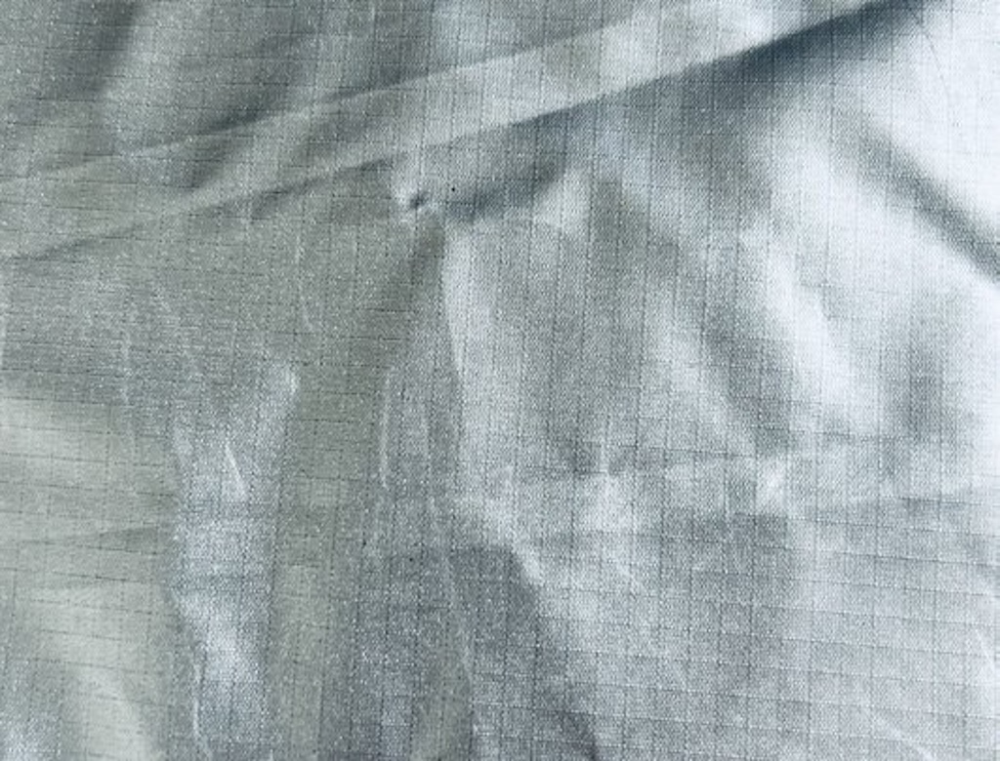
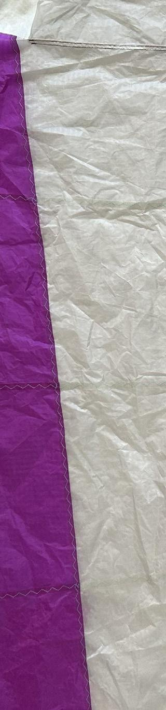

# open-bivy — open hardware, work in progress

**Status: early development.** This repo documents an ongoing process, not a finished product. There are open problems (see [Issues](../../issues) and [Open Problems](#open-problems) below). If you want to think along, test, or build further — see [CONTRIBUTING.md](CONTRIBUTING.md).
More Images and Manuals following soon!

## What this is

A minimal, fast to set up and pack down weather shelter for people sleeping outdoors — not a tent in the classic sense, but an emergency solution with as few parts as possible. This grew out of a design project (product design school) exploring the tension between **mobility and a sense of shelter**: anyone who needs to stay mobile can't also carry a lot of gear — but everyone still needs some minimum of protection.

This is deliberately **not** a donation product manufactured in low-wage countries and then handed out to people in need — that would be a contradiction in itself. The goal is a design simple enough to be built locally, fairly, and with minimal tooling.

That's exactly why this repo is open: the vision is an **open hardware project** that isn't centrally produced and shipped by a single workshop or organisation, but one that motivated people anywhere in the world can build locally themselves, adapt to their own materials and circumstances, and distribute in their own city. No shipping, no supply chains, no central dependency — just an openly documented design that can come together on-site with locally available materials and simple means.

## Design principles

- **No glue, no composite materials.** Only separable, recyclable connections (stitching, Velcro).
- **Minimal production effort.** Few parts, simple patterns, no specialised machinery required.
- **Weight instead of extra hardware.** No stakes, no guy lines — the user's own belongings (backpack, bags) provide the weight needed.
- **Material choice based on availability, not perfection.** Currently built from ripstop nylon and discarded kite/paraglider fabric (offcuts that would otherwise be incinerated).

## Current state

A rough, functional prototype exists — see [`docs/status.md`](docs/status.md) for an honest list of what works and what doesn't.

 
*Ripstop nylon, first material choice.*

 
*Kite/paraglider offcut fabric, second iteration.*

 
*Velcro strips sewn into the batten loops — the only connection method used, fully separable, no adhesives.*

**What works:**
- Sandwich-construction base (ripstop + thermal batting) holds its shape and provides minimal insulation
- Setup via two sail battens (head and foot end), no tools required
- Velcro as the only connection method between parts
- The pattern is digital (vector file) and can be projected onto fabric via projector/pattern-projector software — no templates needed

**What doesn't work yet:**
- Fabric is only tensioned at the head end; the rest hangs loose — see open problems below
- No continuous waterproof seam sealing
- No long-term / weather testing yet

## Open problems

These are the current blockers. If you have an idea, please open an issue rather than a PR — for structural questions, discussion first tends to help everyone.

1. **Fabric tension along the full length without extra battens.** Continuous tension over the whole length would require more sail battens — which increases production effort and cost. Is there a geometry (e.g. different arc tension, different pattern shape) that creates continuous tension with just 2 battens?
2. **Seam waterproofing on coated fabric**, without using adhesive tape (which would go against the "no composite materials" principle).
3. **Scaling production** — currently a one-off, hand-sewn. What low-tech / digital fabrication steps (cutting plotter, fabric laser cutter?) could enable small-batch production without losing the "fair and locally buildable" character?

## Contributing

This project lives from people who'd approach it differently. Read [CONTRIBUTING.md](CONTRIBUTING.md) for how to get involved, and please check out our [Code of Conduct](CODE_OF_CONDUCT.md).

## License

Hardware designs (patterns, CAD files, construction drawings) in this repo are licensed under the **[CERN Open Hardware Licence Version 2 - Strongly Reciprocal (CERN-OHL-S-2.0)](LICENSE)**. In short: you're free to use, modify, and redistribute everything — but if you pass it on (modified or as part of a product), you must make the source/design files available under the same licence. Nobody should be able to take this and lock it away as proprietary.

Documentation text and photos are additionally licensed under [CC BY-SA 4.0](https://creativecommons.org/licenses/by-sa/4.0/) unless noted otherwise.
